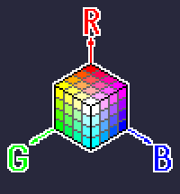

# Color

[`< Overview`](./README.md)

This article is meant to (1) provide an overview of the digital color theory concepts that one should understand in order to best use *Stipple Effect*, and (2) explain and illustrate some of *Stipple Effect*'s color-related jargon and conventions.

## Color spaces

<!-- TODO -->

### RGB

<!-- TODO -->

The RGB color space is best visualized as a cube, where each axis corresponds to one of the red, green and blue color channels. The vertex where the cube is black signifies R, G, and B values of 0, while the vertex where the cube is white signifies maximal R, G, and B values of 255 each. The greyscale gradient from black to white runs between these vertices through the middle of the cube.

**Hex codes**

**Hex codes** are six- or eight-digit alphanumeric codes following a leading `#` that represent digital colors in the RGB color space. Since the maximum value an RGB color channel can have is 255, a base-16 numbering system is the numbering system with the lowest radix that can represent all possible RGB channel values in two digits.

Hexadecimal (base-16) numbering uses the digits 0 to F, where A follows 9. Thus, the digit A = 10, B = 11, and so on. Alphabetical digits can be represented in uppercase or lowercase.

255 is represented in hexadecimal as **FF**:

`FF = F0 + F = (15 * 16) + 15 = 255`

Every 2-digit segment in a hex code corresponds to the value of a color channel. The first two digits correspond to red, digits 3 and 4 to green, and digits 5 and 6 to blue. If present, digits 7 and 8 correspond to the alpha/opacity channel.

From the above example:

*fb0d0d*
* **Red:** fb16 = 251
* **Green and Blue:** 0d16 = 13

*40caa1*
* **Red:** 4016 = 64
* **Green:** ca16 = 202
* **Blue:** a116 = 161

**Read more:**
* [Hex codes on Wikipedia](https://en.wikipedia.org/wiki/Web_colors#Hex_triplet)
* [Hexadecimal (base-16) numbers](https://en.wikipedia.org/wiki/Hexadecimal)

### HSV

<!-- TODO -->

## [System colors](./interface.md#system-colors)

### Combination modes

Some of *Stipple Effect*'s editing [tools](./tools.md) allow for the mixing of the primary and secondary color in a few ways:

* **Dither mode:** Edited pixels are allocated to either the primary or secondary color based on 4x4 ordered dithering
* **Blend mode:** The blended color is the result of a linear interpolation of the primary and secondary color
* **Noise mode:** Each painted pixel's color is the result of a linear interpolation of the primary and secondary color with a random `t` value [**[see here]**](../api/graphics.md#lerp_color)

The degree to which the combination mode favours either the primary or the secondary color can be adjusted with the **combination mode bias** slider in the [tool options bar](./interface.md#tool-options).

