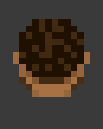

# Preview scripts

[`< Scripting`](scripting.md)

*Stipple Effect* has a [preview window](./preview-window.md) to give the user a secondary viewport with which to view the [project](./project.md) alongside the [workspace](./interface.md#workspace). By default, the preview window merely displays the project as it currently is. However, with **preview scripts**, the user can define an algorithm that transforms the project's contents for the sake of display in the preview window.

The script is executed every time that the user edits the project. An edit to the project might be a brush stroke or an [undo](./state-control.md#undo) operation or a paste action. However, advancing the frame index, for example, would not be considered an edit.

## Contract

*How preview scripts must be structured to be accepted by the program*

Preview scripts can have a few possible [type signatures](https://en.wikipedia.org/wiki/Type_signature):

* They must take a single parameter<sup>1, 2</sup>. This can either be an `image` or an array of images `image[]`.
* They must return either an `image` or an array of images `image[]`. The return type is not correlated with the parameter type.

Thus, the head function of a preview script can take any of the following forms<sup>3, 4</sup>:
1.  ```js
    (image img -> image) { /* contents here... */ }
    ```
2.  ```js
    (image img -> image[]) { /* contents here... */ }
    ```
3.  ```js
    (image[] imgs -> image) { /* contents here... */ }
    ```
4.  ```js
    (image[] imgs -> image[]) { /* contents here... */ }
    ```

**Note:**

<sup>1</sup> - The parameter names `img` and `imgs` are merely used as examples.

<sup>2</sup> - The parameter represented by `img`/`imgs` can optionally be declared as immutable by prepending `final` or `~` to the declaration. For example:

```js
(~ image img -> image) { /* contents here... */ }
```

<sup>3</sup> - Preview scripts do not have to have complex function bodies `{ ... }`. For example, the following preview script is valid:

```js
(image[] imgs -> image) -> imgs[0]
```

<sup>4</sup> - An image to array of images preview script (signature `image img -> image[]`) is only valid for [static](./frame.md) projects i.e. projects consisting of a single frame.

## Example

The applications of preview scripts are virtually endless. They can range from simple scripts that transform a project to greyscale, to complex use cases such as this:

| Input | Output |
| :---: | :----: |
|  |  |

**Note:**

Input is scaled up 4x and output is scaled up 8x and cropped.

This example is achieved with the following script:

```js
(~ image texture -> image[]) {
    // constants
    ~ string BASE_FOLDER = "C:/Users/example/file/path/";
    ~ string TEX_LOOKUP_FOLDER = BASE_FOLDER + "texture/";
    ~ string ANIM_LOOKUP_FOLDER = BASE_FOLDER + "anim/";
    ~ image LOOKUP_ANIM = read_image(ANIM_LOOKUP_FOLDER + "head.png");
    ~ image LOOKUP_TEX = read_image(TEX_LOOKUP_FOLDER + "head.png");

    // uses the lookup animation and lookup texture to map the input texture to its animated equivalent
    ~ image anim_head = $Graphics.uv_mapping(texture, LOOKUP_TEX, LOOKUP_ANIM);

    ~ int EXPRESSION_COUNT = 5;
    ~ int DIRECTIONS = 8;
    ~ image[] expressions = new image[EXPRESSION_COUNT];
    ~ image[] frames = new image[EXPRESSION_COUNT * DIRECTIONS];

    for (int i = 0; i < EXPRESSION_COUNT; i++) {
        ~ image expressionLookup = read_image(ANIM_LOOKUP_FOLDER + "eyebrows_" + i + ".png");
        ~ image expression = $Graphics.uv_mapping(texture, LOOKUP_TEX, expressionLookup);
        expressions[i] = expression;

        for (int j = 0; j < DIRECTIONS; j++) {
            ~ int fw = expression.w / 8;
            ~ int fh = expression.h;
            ~ int x = -fw * j;

            ~ image frame = new_image_of(fw, fh);
            frame.draw(anim_head, x, 0);
            frame.draw(expression, x, 0);

            frames[(i * DIRECTIONS) + j] = frame;
        }
    }

    return frames;
}
```

### Assets

These are the assets read from their file paths and stored in the following variables:

<!-- TODO -->

| Variable | Asset |
| :---: | :----: |
| `LOOKUP_TEX` |  |
| `LOOKUP_ANIM` |  |
| `expressionLookup` (1st loop execution) |  |
| `expressionLookup` (2nd loop execution) |  |
| `expressionLookup` (3rd loop execution) |  |
| `expressionLookup` (4th loop execution) |  |
| `expressionLookup` (5th loop execution) |  |

### Description

<!-- TODO -->

### Functions

<!-- TODO -->

---

**SEE ALSO**

* [Preview script examples](https://github.com/jbunke/se-script-examples/tree/main/scripts/preview)
* [Preview window](./preview-window.md)
