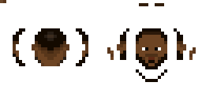
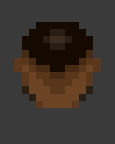
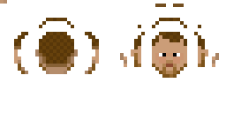
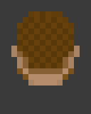
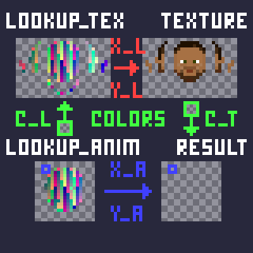
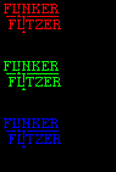
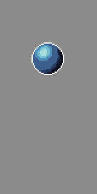
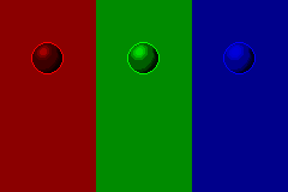

# Preview scripts

[`< Scripting`](scripting.md)

*Stipple Effect* has a [preview window](./preview-window.md) to give the user a secondary viewport with which to view the [project](./project.md) alongside the [workspace](./interface.md#workspace). By default, the preview window merely displays the project as it is. However, with **preview scripts**, the user can define an algorithm that transforms the project's contents for the sake of display in the preview window.

The script is executed every time that the user edits the project. An edit to the project might be a brush stroke or an [undo](./state-control.md#undo) operation or a paste action. However, advancing the frame index, for example, is not considered an edit.

**Note:**

Preview script transformations merely affect the preview. **These transformations are not applied to the project itself.** However, the results of preview script transformations can be [converted into full-fledged projects](./preview-window.md#converting-preview-script-transformations-into-projects).

## Contract

*How preview scripts must be structured to be accepted by the program*

Preview scripts can have a few possible [type signatures](https://en.wikipedia.org/wiki/Type_signature):

* They must take a single parameter<sup>1, 2</sup>. This can either be an `image` or an array of images `image[]`.
* They must return either an `image` or an array of images `image[]`. The return type is not correlated with the parameter type.

Thus, the head function of a preview script can take any of the following forms<sup>3, 4</sup>:
1.  ```js
    (image img -> image) { /* contents here... */ }
    ```
2.  ```js
    (image img -> image[]) { /* contents here... */ }
    ```
3.  ```js
    (image[] imgs -> image) { /* contents here... */ }
    ```
4.  ```js
    (image[] imgs -> image[]) { /* contents here... */ }
    ```

**Note:**

<sup>1</sup> - The parameter names `img` and `imgs` are merely used as examples.

<sup>2</sup> - The parameter represented by `img`/`imgs` can optionally be declared as immutable by prepending `final` or `~` to the declaration. For example:

```js
(~ image img -> image) { /* contents here... */ }
```

<sup>3</sup> - Preview scripts do not have to have complex function bodies `{ ... }`. For example, the following preview script is valid:

```js
(image[] imgs -> image) -> imgs[0]
```

<sup>4</sup> - An image to array of images preview script (signature `image img -> image[]`) is only valid for [static](./frame.md) projects i.e. projects consisting of a single frame.

## Example 1

The applications of preview scripts are virtually endless. They can range from simple scripts that transform a project to greyscale, to complex use cases such as this:

| Input | Output |
| :---: | :----: |
|  |  |
|  |  |
|  |  |

**Note:**

Input is scaled up 4x and output is scaled up 8x and cropped.

This example is achieved with the following script:

```js
(~ image texture -> image[]) {
    // constants
    ~ string BASE_FOLDER = "C:/Users/example/file/path/";
    ~ string TEX_LOOKUP_FOLDER = BASE_FOLDER + "texture/";
    ~ string ANIM_LOOKUP_FOLDER = BASE_FOLDER + "anim/";
    ~ image LOOKUP_ANIM = read_image(ANIM_LOOKUP_FOLDER + "head.png");
    ~ image LOOKUP_TEX = read_image(TEX_LOOKUP_FOLDER + "head.png");

    // uses the lookup animation and lookup texture to map the input texture to its animated equivalent
    ~ image anim_head = $Graphics.uv_mapping(texture, LOOKUP_TEX, LOOKUP_ANIM);

    ~ int EXPRESSION_COUNT = 5;
    ~ int DIRECTIONS = 8;
    ~ image[] frames = new image[EXPRESSION_COUNT * DIRECTIONS];

    for (int i = 0; i < EXPRESSION_COUNT; i++) {
        ~ image expressionLookup = read_image(ANIM_LOOKUP_FOLDER + "eyebrows_" + i + ".png");
        ~ image expression = $Graphics.uv_mapping(texture, LOOKUP_TEX, expressionLookup);

        for (int j = 0; j < DIRECTIONS; j++) {
            ~ int fw = expression.w / 8;
            ~ int fh = expression.h;
            ~ int x = -fw * j;

            ~ image frame = new_image_of(fw, fh);
            frame.draw(anim_head, x, 0);
            frame.draw(expression, x, 0);

            frames[(i * DIRECTIONS) + j] = frame;
        }
    }

    return frames;
}
```

### Assets

This script makes use of auxiliary assets to define a UV mapping between a texture and a 2D animation.

These are the assets read from their file paths and stored in the following variables:

| File path | Variable | Asset |
| :---: | :---: | :----: |
| `../path/texture/head.png` | `LOOKUP_TEX` |  |
| `../path/anim/head.png` | `LOOKUP_ANIM` |  |
| `../path/anim/eyebrows_0.png` | `expressionLookup` (1st loop exec.) |  |
| `../path/anim/eyebrows_1.png` | `expressionLookup` (2nd loop exec.) |  |
| `../path/anim/eyebrows_2.png` | `expressionLookup` (3rd loop exec.) |  |
| `../path/anim/eyebrows_3.png` | `expressionLookup` (4th loop exec.) |  |
| `../path/anim/eyebrows_4.png` | `expressionLookup` (5th loop exec.) |  |

### Description

This script takes an input image `texture`. The script then reads the image assets listed above.

`texture` should have the same dimensions as `LOOKUP_TEX`. `LOOKUP_ANIM` defines an animation sprite sheet using only colors that are found in `LOOKUP_TEX`. Every non-transparent color in `LOOKUP_TEX` should occur at only a single pixel.

 `$Graphics.uv_mapping(...)` uses the texture supplied with the input `texture` to produce a textured animation sprite sheet with the auxiliary lookup assets `LOOKUP_TEX` and `LOOKUP_ANIM`. The way it does this is by:
 
 1. scanning every pixel of `LOOKUP_ANIM`
 2. For every non-transparent pixel with color `c_l` at position `x_a`, `y_a` in `LOOKUP_ANIM`, it looks for `x_l` and `y_l` - the coordinates of first and ideally only pixel with color `c_l` in `LOOKUP_TEX`.
 3. It then samples the color `c_t` of the pixel at `x_l` and `y_l` in `texture`, and paints the pixel at position `x_a`, `y_a` of the resultant image with the color `c_t`.

`$Graphics.uv_mapping(texture, LOOKUP_TEX, LOOKUP_ANIM)` visualization:



 This will produce the following intermediate image as the value of `anim_head`:

| `texture` | `anim_head` |
| :---: | :---: |
|  |  |

The outer `for` loop has a similar functionality as the code before the loop, but instead of performing a UV mapping for the head, each loop execution performs a UV mapping for a different **eyebrow expression**.

These are then superimposed on copies of `anim_head`, sliced into 8 directions in the inner `for` loop, and added to the animation array `frames`.

### Functions

This script utilizes the following API function:

* [`$Graphics.uv_mapping(image texture, image map, image animation) -> image`](../api/graphics.md#uv_mapping)

This script utilizes the following functions from the *DeltaScript* base language [standard library](https://github.com/jbunke/deltascript): <!-- TODO - GitHub link to SL -->

<!-- TODO - links to specific functions in the SL -->

* `read_image(string filepath) -> image`
* `new_image_of(int width, int height) -> image`
* `image:draw(image overlay, int x, int y)`

## Example 2

| Input | Output |
| :---: | :----: |
|  |  |
|  |  |

This example is achieved with the following script:

```js
(~ image orig -> image) {
    ~ int w = orig.w; ~ int h = orig.h;
    ~ bool vert = w > h;

    ~ (color -> color)[] fs = [ ::iso_r, ::iso_g, ::iso_b ];

    ~ int CHANNELS = #|fs;
    ~ image separated = vert
            ? new_image_of(w, h * CHANNELS)
            : new_image_of(w * CHANNELS, h);

    for (int i = 0; i < CHANNELS; i++) {
        ~ image c_img = new_image_of(w, h);
        ~ (color -> color) f = fs[i];

        for (int x = 0; x < w; x++)
            for (int y = 0; y < h; y++)
                c_img.dot(f.call(orig.pixel(x, y)), x, y);
        
        separated.draw(c_img, vert ? 0 : i * w, vert ? i * h : 0);
    }

    return separated;
}

iso_r(color c -> color) -> rgba(c.r, 0, 0, c.a)
iso_g(color c -> color) -> rgba(0, c.g, 0, c.a)
iso_b(color c -> color) -> rgba(0, 0, c.b, c.a)
```

### Description

This script arranges three edited copies of the input image `orig` next to each other. Each copy has a different [RGB color channel](./color.md#rgba) isolated: red, green, and blue.

If `orig` is wider than it is tall, the copies are stacked vertically. If not, they are stacked side by side.

### Functions

This script does not utilize any functions from the scripting API.

However, it makes use of the following functions from the *DeltaScript* base language [standard library](https://github.com/jbunke/deltascript): <!-- TODO - GitHub link to SL -->

<!-- TODO - links to specific functions in the SL -->

* `new_image_of(int width, int height) -> image`
* `rgba(int r, int g, int b, int alpha) -> color`
* `image:dot(color c, int x, int y)`
* `image:draw(image overlay, int x, int y)`
* `image:pixel(int x, int y) -> color`

---

**SEE ALSO**

* [Preview script examples](https://github.com/jbunke/se-script-examples/tree/main/scripts/preview)
* [Preview window](./preview-window.md)
