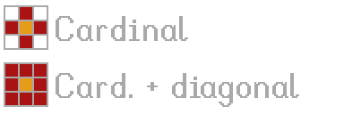

# Selection area tools

[`< Tools`](./tools.md)

## Universal

Selection area tools have **simple**, **additive**, and **subtractive** selection modes:

### Simple selection

Any previous selection is **overridden** and the results of the selection operation comprise the new selection.

### Additive selection (hold <kbd>Ctrl</kbd>)

The pixels captured in the selection operation are **added** to the selection prior to the operation.

Tool cursors will have a `+` symbol next to the reticle to indicate the tool is in additive mode:

 
 
 

### Subtractive selection (hold <kbd>S</kbd>)

The pixels captured in the selection operation are **removed** from the selection prior to the operation.

Tool cursors will have a `-` symbol next to the reticle to indicate the tool is in subtractive mode:

 
 
 

## Brush Select

**Icon:** 

**Hotkey:** <kbd>V</kbd>

### Behaviour

<!-- TODO -->

## Wand

**Icon:** 

**Hotkey:** <kbd>W</kbd>

### Behaviour

<!-- TODO -->

* performs a search operation that captures pixels based on how similar their color is to the pixel that initiated the operation
* modifies the selection with the pixels captured by the search operation in different ways depending on the **mode**:
  * **Standard mode:** selects the captured pixels
  * **Additive mode:** adds the captured pixels to the existing selection
  * **Subtractive mode:** removes the captured pixels from the existing selection
* replaces the color of all captured pixels with either the primary or secondary [system color](./color.md#system-colors)

## Actions

* **Fill with primary color:** 
* **Fill with secondary color:** 
* **Adjust tolerance:** *Arrow Keys* or <kbd>Shift</kbd> + *Scroll Wheel*

## Modifiers

* <kbd>Shift</kbd> - hold to enable **global mode**

## Tool Options

* **Tolerance:** determines how similar adjancent colors must be for the fill to spread
* **Search diagonally:** when turned on, diagonal pixels are checked for adjacency in addition to cardinally adjacent pixels.

## Box Select

**Icon:** 

**Hotkey:** <kbd>X</kbd>

### Behaviour

<!-- TODO -->

## Polygon Select

**Icon:** 

**Hotkey:** <kbd>Y</kbd>

### Behaviour

<!-- TODO -->
